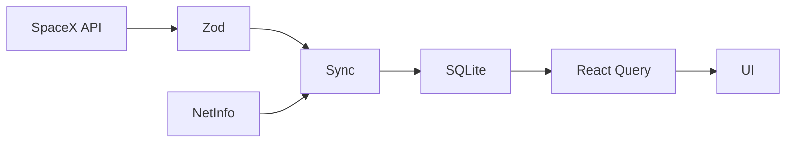

# Architecture

The app uses SQLite as the offline source of truth. Launches flow from the SpaceX API through Zod validation into SQLite, then React Query exposes cached data immediately while a deduplicated background sync refreshes it.

